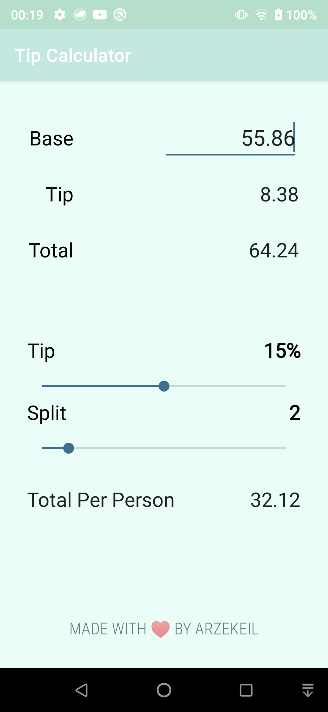

# Tip Calculator Android App
A simple Android app written using Kotlin to calculate the tip based on a percentage of the bill amount and to calculate how much each person would have to pay if they decide to split the bill.

